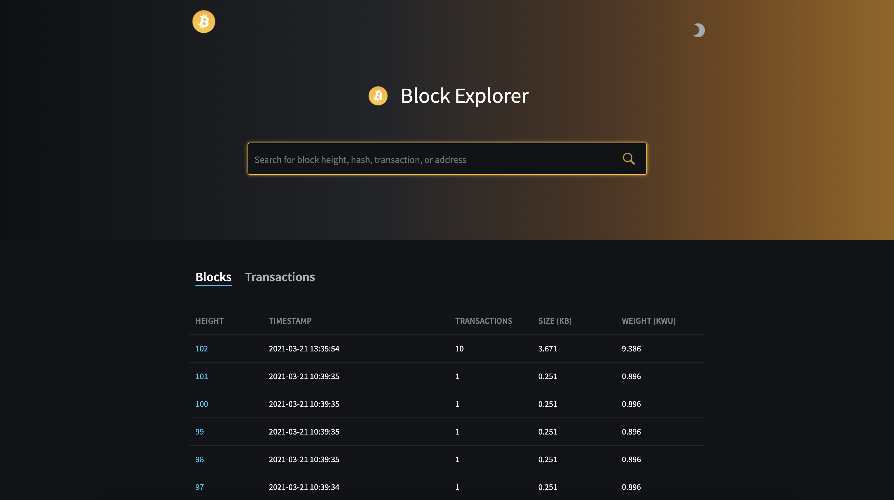
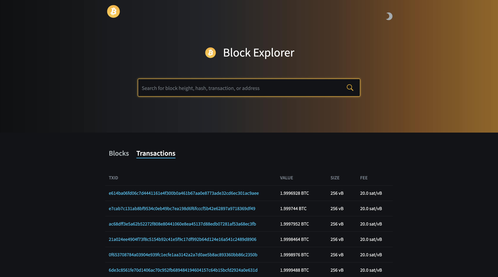

# 🧪 Lab
Set up development test environment, use CLI

## 🕣 Duration
5-10 minutes

## 🍽️ Description
Goal of this lab is to quickly set up Bitcoin full node and play around with CLI.<br>
Also, to familiarize with basic entities like blocks and transactions.

## Requirements
Docker 

# Let's start ...

### - Installation
To set up personal Bitcoin blockchain we will be using new tool for Bitcoin developers: [Nigiri Bitcoin](https://nigiri.vulpem.com/). <br>
Check out [Nigiri Blog](https://github.com/vulpemventures/nigiri) and [Git Repo](https://github.com/vulpemventures/nigiri) for more details.<br>
If you like it don't hesitate to give it a star 🙂.<br>
```
curl https://getnigiri.vulpem.com | bash
```

### - Start Bitcoin
```
nigiri start
```
That's it 🙂. Now you have everything you need to play around with Bitcoin CLI. <br/>
After Docker starts containers, go to http://localhost:5000 to quickly inspect the Bitcoin blockchain.

### - Steps to create transaction
1. Create alias for Bitcoin CLI
```
alias b="docker exec -it bitcoin bitcoin-cli -datadir=/config"
```
2. Show available CLI commands:
```
bitcoin-cli -datadir=/config help
```
3. Generate new address
```
b getnewaddress
```
4. Sent 1 BTC to address from step 3.
```
b sendtoaddress {ADDRESS} 1
```
5. Add transaction to block
```
b generatetoaddress 1 $(b getnewaddress)
```
6. Get transaction hex using TXID from step 4.
```
b gettransaction {TXID} | jq .hex
```
7. Decode transaction using HEX from step 6.
```
b decoderawtransaction {HEX}
```
You should see decoded transaction, eg. bellow:
```
{
  "txid": "3779476c1b6c6d0401be210fe54022a7c8ce1a805e2852fddac60469d4a05e16",
  "hash": "9efd638ec5dd31332a8a59e2849661ad12a0b28f1ccd31e54928e9112831f389",
  "version": 2,
  "size": 170,
  "vsize": 143,
  "weight": 572,
  "locktime": 0,
  "vin": [
    {
      "coinbase": "01660101",
      "sequence": 4294967295
    }
  ],
  "vout": [
    {
      "value": 50.00042480,
      "n": 0,
      "scriptPubKey": {
        "asm": "OP_HASH160 439c28d00de511296b8a2cd78a74e71651a4b761 OP_EQUAL",
        "hex": "a914439c28d00de511296b8a2cd78a74e71651a4b76187",
        "reqSigs": 1,
        "type": "scripthash",
        "addresses": [
          "2MyQiLHQPYoZXvsd6psimyh2hyN7iixemQB"
        ]
      }
    },
    {
      "value": 0.00000000,
      "n": 1,
      "scriptPubKey": {
        "asm": "OP_RETURN aa21a9ed01e4e9103f42c86f105b25383c5dc16ccecb3b42779ac8a812bef25f6cb0d4b6",
        "hex": "6a24aa21a9ed01e4e9103f42c86f105b25383c5dc16ccecb3b42779ac8a812bef25f6cb0d4b6",
        "type": "nulldata"
      }
    }
  ]
}
```
9. Check blocks and transaction in GUI also, http://localhost:5000 <br>

Blocks: <br>


Transactions: <br>
